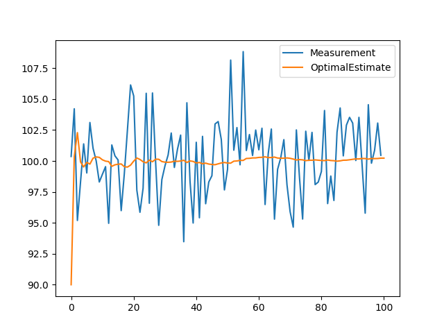

# 卡尔曼滤波从浅到深

### 引入：一个简单的例子
在这一部分，我们将估计一个静态系统（系统的状态不随着时间而变化）的状态。例如一块金条的质量是不随时间而改变的。  
由于测量误差的存在，我们需要通过多次测量取平均值的方式来得到金条的真实质量。

假设第N次测量的质量是$z_N$,那么在第N次测量时，金条值的最优估计（就是我认为第N次测量时候金条应该多种）：
$\hat{x}_{N,N}= \frac{1}{N} \left( z_{1}+ z_{2}+ \ldots+z_{N-1}+ z_{N} \right) = \frac{1}{N} \sum _{n=1}^{N} \left(z_{n} \right)$
- $\hat{x}_{N,N}$次测量后对N时刻$x$的估计值。
- $\hat{x}_{N+1,N}$表示第N次测量后对N+1时刻$x$的估计值。
由于我们研究的是静态系统，因此这里$\hat{x}_{N,N}= \hat{x}_{N+1,N}$
从上面这个公式可以看出，如果想要的到N时刻$x$的最优估计值，需要记住所有的历史值，假设我们现在没有纸和笔，想用上一时刻的最优估计值以及这一时刻的测量值来计算这一时刻的最优估计值。（卡尔曼滤波的思想雏形）
对公式做一个变换可以得到
$\hat{x}_{N,N}= \frac{1}{N} \sum _{n=1}^{N} \left( z_{n} \right) = \hat{x}_{N,N-1}+ \frac{1}{N} \left( z_{N}- \hat{x}_{N,N-1} \right)$
从这个公式中看出，N时刻的最优估计值是由N-1时刻对N时刻的预测值和N时刻的测量值结合而成。

注意这里的1/N就是我们常说的卡尔曼增益，只不过这个例子里比较简单，这里我们先按下不表。
至此我们得到了卡尔曼滤波的第一个公式，状态更新公式。
$\hat{x}_{n,n}= \hat{x}_{n,n-1}+  \alpha _{n} \left( z_{n}-\hat{x}_{n,n-1} \right)$,这里$\alpha_{n}$就是上面的$\frac{1}{N}$
如何解释这个方程呢？就好比N-1时刻你得到金条的质量会是$\hat{x}_{n,n-1}$,但是你N时刻自己又称了一下发现不是这个值，这个时候你到底是应该信N-1时刻你得到的金条质量还是N时刻你测量得到的金条质量呢？上述方程的$\alpha _{n}$就类似一个比例，对N-1时刻的最优估计和N时刻的测量值加权得到N时刻的最优估计。
- （注意这里并不是说N时刻和N-1时刻金条的质量会发生改变，N时刻只是比N-1时刻多测量了一次而已。）
这里我们假设测量产生误差满足高斯分布，设定金条的质量是100，可以发现即使一开始设定的最优估计（没有测量瞎猜的质量值）有很大偏差，最优估计值最终仍然会收敛到100。

这里把最优估计与真实值之间的方差记作$p$(Uncertainty in Estimate),测量值与真实值之间的方差记作$r$(Uncertainty in Measurement)
有了这两个参数，就得到了卡尔曼增益的方程。
$K_{n}= \frac{Uncertainty \quad in \quad Estimate}{Uncertainty \quad in \quad Estimate \quad + \quad Uncertainty \quad in \quad Measurement}= \frac{p_{n,n-1}}{p_{n,n-1}+r_{n}}$
$p_{n,n-1}$表示在n-1时刻对n时刻p的预测
可以看到卡尔曼增益实际上是一个0到1之间的数，也就是之前提到的表示最优估计与测量值之间的权重。
$\hat{x}_{n,n}=~ \hat{x}_{n,n-1}+ K_{n} \left( z_{n}- \hat{x}_{n,n-1} \right) = \left( 1-K_{n} \right) \hat{x}_{n,n-1}+ K_{n}z_{n}$
可以发现$K_n$是测量值的权重，$1-K_n$是最优估计值的权重
当测量误差较大的时候，即Uncertainty in Measurement 较大时候，卡尔曼增益较小，对应测量值的权重应当减小。

从图中可以看出p是会随着迭代次数增加逐渐减小的，因此随着迭代次数的增加，我们还需要去更新p。
$p_{n,n}=~  \left( 1-K_{n} \right) p_{n,n-1}$
从公式的角度也可以发现，随着迭代次数的增加p值会逐渐减小。

### 引入：另外一个简单的例子
上面讲的例子是一个静态系统，接着我们来研究动态系统。

飞机以恒定速度从x1运动到x2，超声波雷达每隔一段时间测量飞机的位置得到方程:
$x_{n+1}= x_{n}+  \Delta t\dot{x}_{n}$
$\dot{x}_{n+1}= \dot{x}_{n}$
这个方程叫做预测方程,比如$t_1$时刻飞机处在$x_1$位置,经过一段时间到$t_2$后,预测飞机处在$x_2$位置
